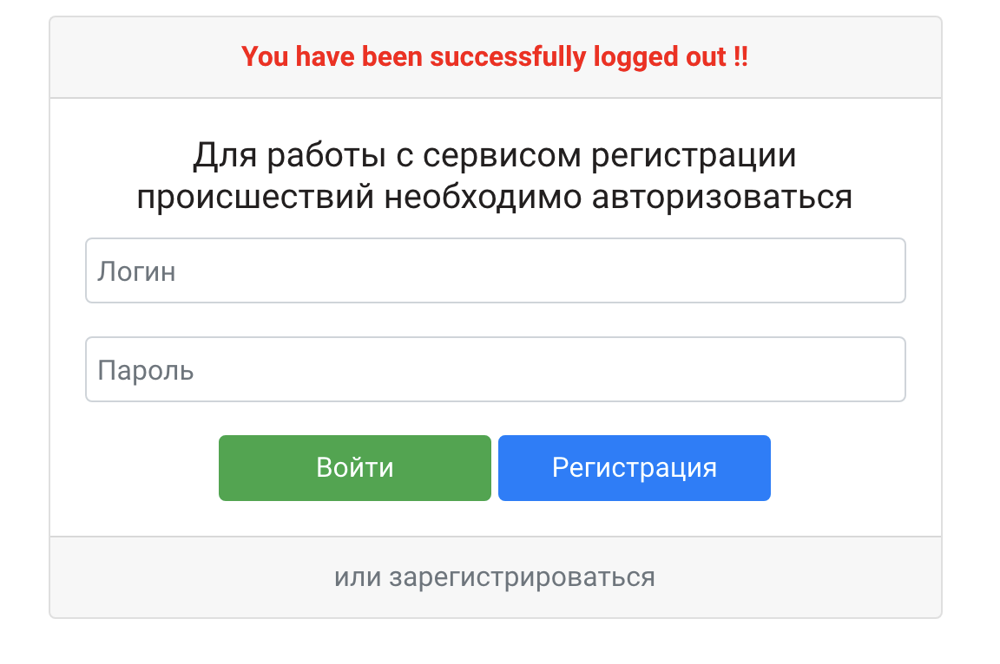
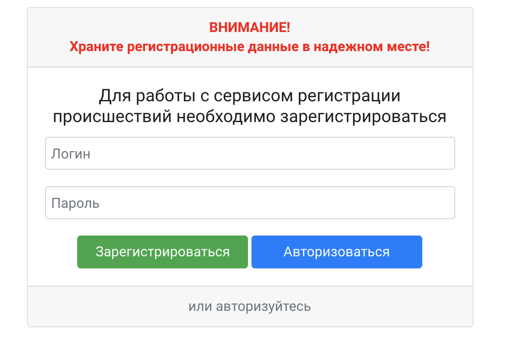
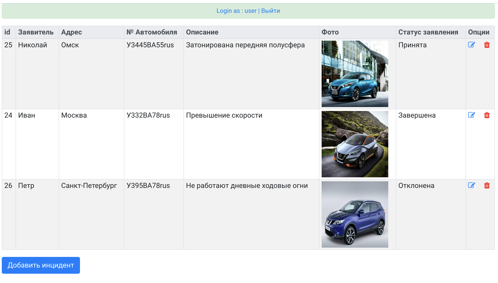
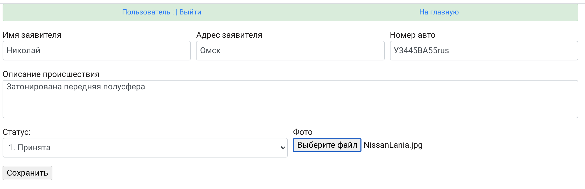
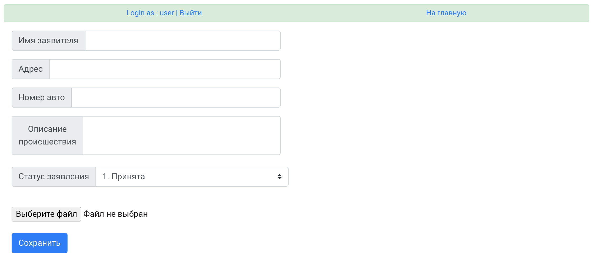

# Проект "Автонарушители"

Стек использованных технологий:
* Java Core 14
* HTML5, CSS3, Bootstrap
* JSP, JSTL
* JDBC, Hibernate, PostgreSQL
* Spring 5 (Core, Web, Data, Security)

Web-приложение учета поступивших сообщений о происшествиях в сфере регулирования дорожного движения.

В приложении реализована регистрация и аутентификация пользователей приложения, d
 системе предусмотрено 2 роли - пользователи и автоинспекторы.
Пользоваться сервисом могут только авторизованные пользователи. 

__Страница авторизации__

__Страница регистрации__

__Главная страница__
 - отображение списка зарегистрированных происшествий. Доступно редактирование, удаление, добавление нового происшествия.
 
 

* Страница __редактирования__

* Страница __добавления нового сообщения__.

